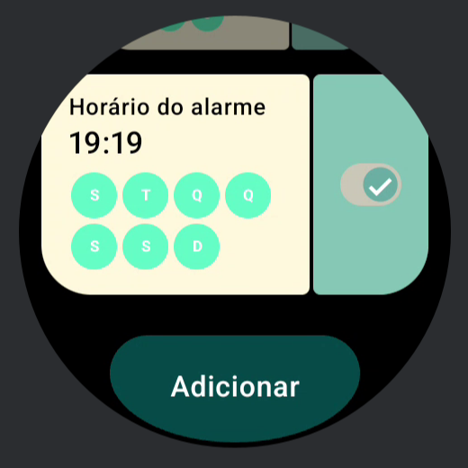
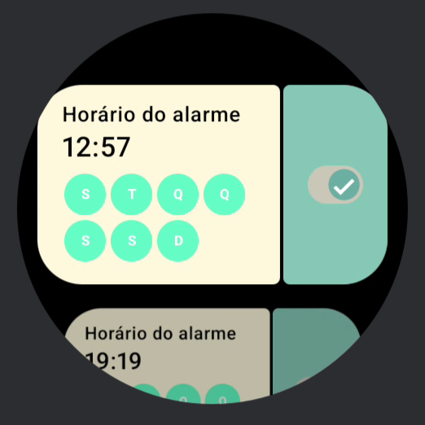
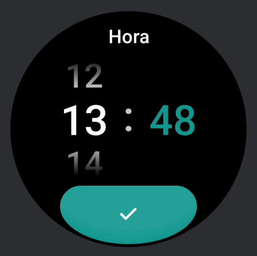
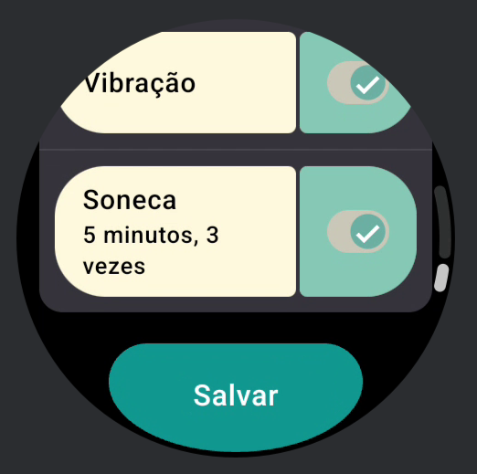
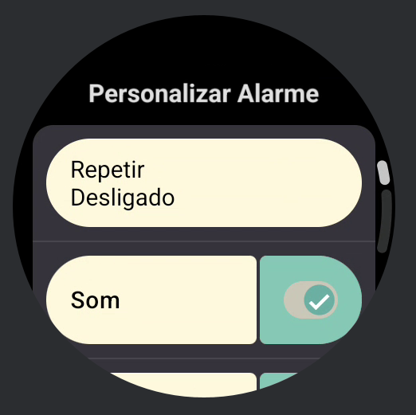
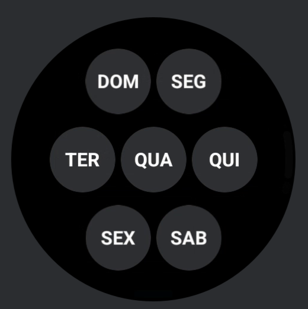
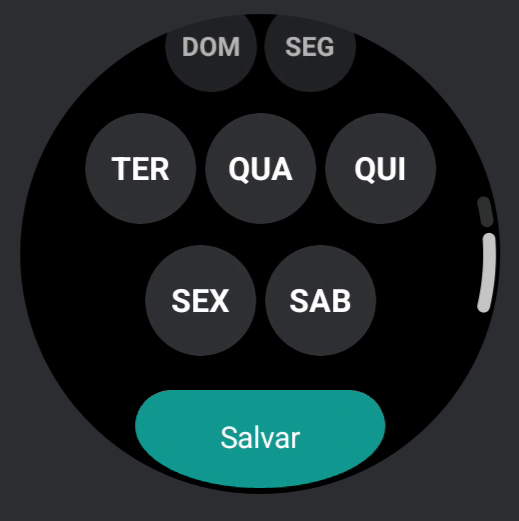
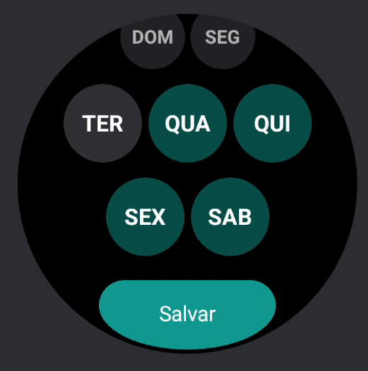
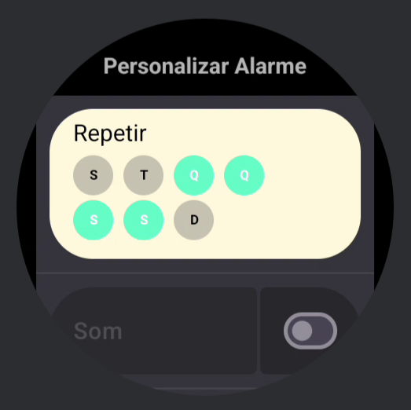
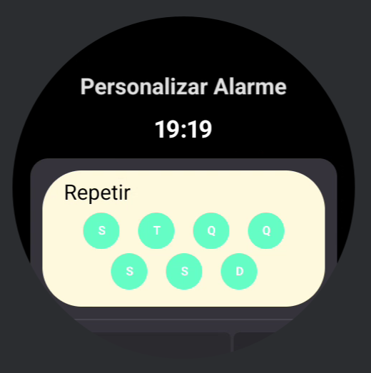

# Alarm Wear App

## Novidades

- Novo design
- Aprimoramento do código

## Descrição

Projeto desenvolvido para demonstrar a utilização do Material 3 Expressive e Material Navigation 3

## Tecnologias utilizadas

## Preview

