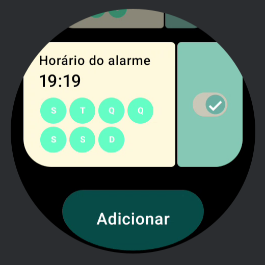
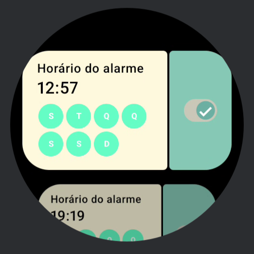
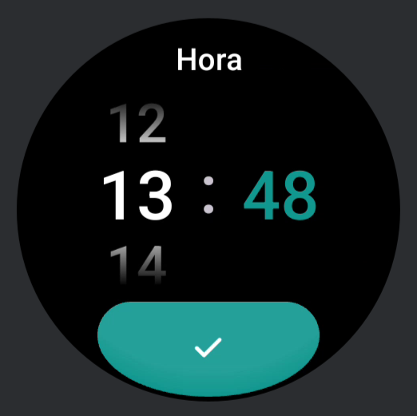
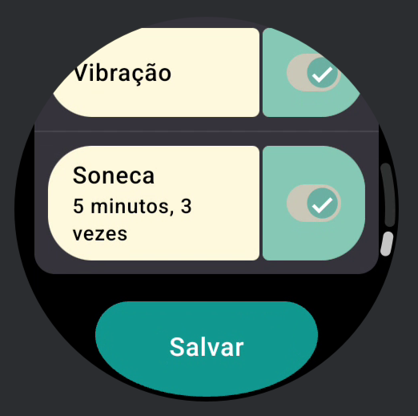
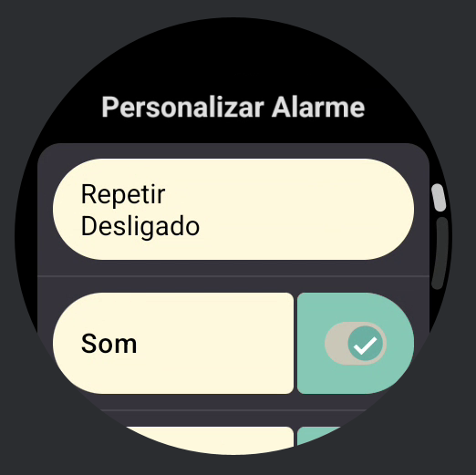
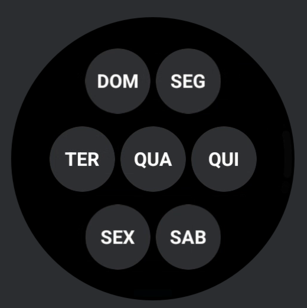
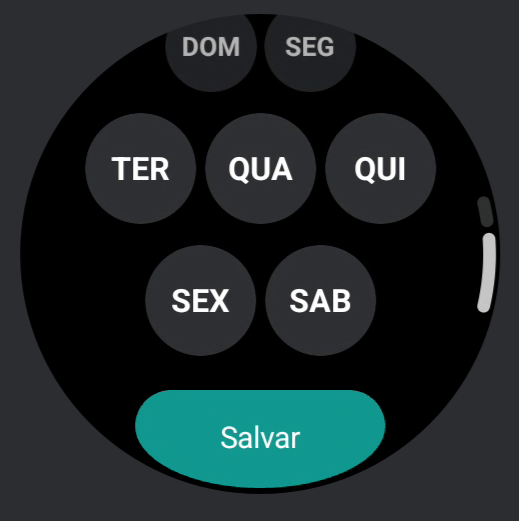
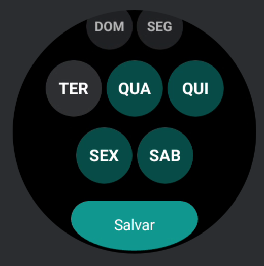
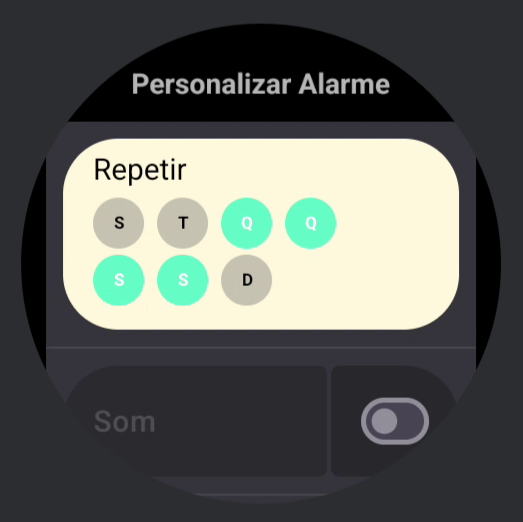
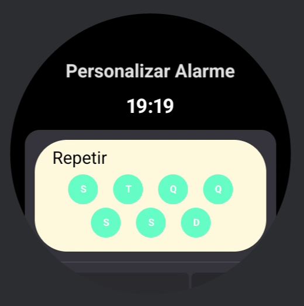

# Acordaí - Smart Alarm for Wear OS

[](https://github.com/davigomesflorencio/alarm_wear_app/actions/workflows/kotlin.yaml)

## Latest Updates

- **Material 3 Expressive Design**: Full overhaul using the latest Material Design standards for Wear OS.
- **Material Navigation 3**: Implementation of the new navigation system for a smoother user experience.
- **Microsoft Clarity Integration**: Integrated for performance monitoring and user experience insights.
- **Code Refactoring**: Improved architecture and efficiency for better wearable performance.

## Description

**Acordaí** is a smart alarm application developed specifically for Wear OS devices. It focuses on providing a modern, fluid, and visually stunning experience directly on your smartwatch, leveraging the latest Android design and navigation standards.

This project serves as a practical demonstration of **Material 3 Expressive** and **Material Navigation 3**, ensuring an intuitive, accessible interface aligned with current Google guidelines for wearables. It combines real-world utility with a clean, modular code architecture.

## Tech Stack

<p align="left">
  
  
  
  
  
</p>

- **Language**: Kotlin + Kotlin Serialization
- **UI Framework**: Jetpack Compose for Wear OS
- **Design System**: Material 3 Expressive
- **Navigation**: Material Navigation 3
- **Dependency Injection**: Koin
- **Local Database**: Room
- **Background Work**: WorkManager
- **Analytics**: Microsoft Clarity
- **CI/CD**: GitHub Actions (Tag-triggered APK releases)

## Preview

<div align="center">
  
  
  
</div>

<div align="center">
  
  
  
</div>

<div align="center">
  
  
  
</div>

<div align="center">
  
</div>

## Building the Project

1. Clone the repository:
   ```bash
   git clone https://github.com/davigomesflorencio/alarm_wear_app.git
   ```
2. Open in **Android Studio** (Ladybug or newer recommended).
3. Ensure you have the **Wear OS SDK** installed.
4. Run the project on a Wear OS emulator or physical device.

---
Developed by [Davi Gomes Florencio](https://github.com/davigomesflorencio)
