<div>
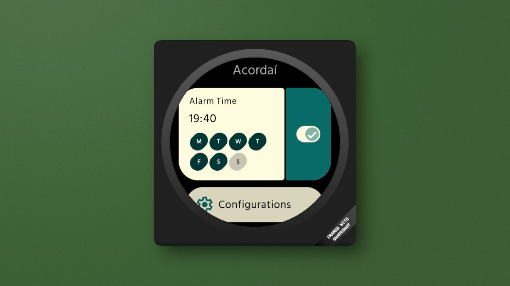

</div>

# Acordaí - Smart Alarm for Wear OS

[](https://play.google.com/store/apps/details?id=davi.android.alarmapp)

## Latest Updates (v1.5.4)

- **Material 3 Expressive Design**: Full overhaul using the latest Material Design standards for Wear OS, featuring rich components and adaptive layouts.
- **Material Navigation 3**: Implementation of the new type-safe navigation system for a smoother and more robust user experience.
- **Improved Alarm Scheduling**: Enhanced background stability using WorkManager and Room for reliable alarm triggers.
- **Sound Customization**: Support for selecting and previewing alarm ringtones directly on the watch.
- **Dedicated Settings Screen**: Quick access to application version, terms of use, and privacy policy.

## Description

**Acordaí** is a smart alarm application developed specifically for Wear OS devices. It focuses on providing a modern, fluid, and visually stunning experience directly on your smartwatch, leveraging the latest Android design and navigation standards.

This project serves as a practical demonstration of **Material 3 Expressive** and **Material Navigation 3**, ensuring an intuitive, accessible interface aligned with current Google guidelines for wearables. It combines real-world utility with a clean, modular code architecture.

## Key Features

- 🕒 **Intuitive Time Selection**: Fast and easy alarm setting optimized for circular screens.
- 📅 **Flexible Recurrence**: Set alarms for specific days of the week with visual indicators.
- 🎵 **Sound & Vibration**: Full control over alarm alerts, including ringtone selection and vibration toggles.
- 💤 **Smart Snooze**: Configurable snooze options (5 minutes, 3 times) to help you wake up at your own pace.
- 🎨 **Modern UI**: A stunning visual interface that follows the Material 3 Expressive guidelines.
- 🔒 **Privacy Focused**: No personal data collection, working entirely on-device.

## Tech Stack

<p align="left">
  
  
  
  
  
</p>

- **Language**: Kotlin + Kotlin Serialization (Type-safe navigation and data)
- **UI Framework**: Jetpack Compose for Wear OS (Material 3 Expressive)
- **Navigation**: Material Navigation 3 (State-of-the-art navigation library)
- **Dependency Injection**: Koin (Modular and lightweight DI)
- **Local Database**: Room (Persistent storage for alarms)
- **Background Work**: WorkManager (Reliable alarm scheduling)
- **Analytics**: Microsoft Clarity (Performance monitoring and user insights)
- **CI/CD**: GitHub Actions (Automated APK releases)

## Preview (v1.5.0)

<div align="center">
  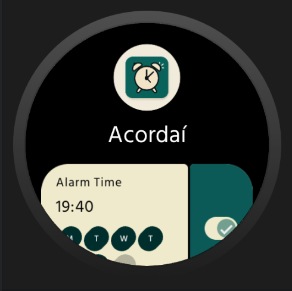
  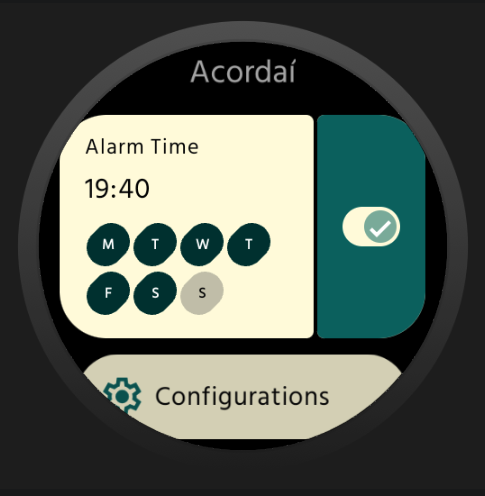
  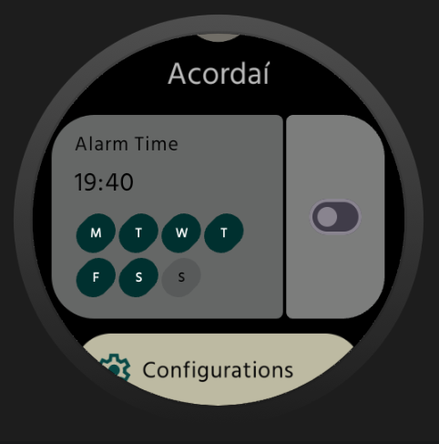
</div>

<div align="center">
  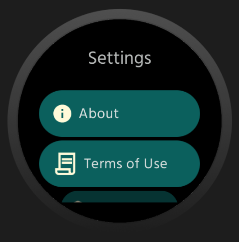
  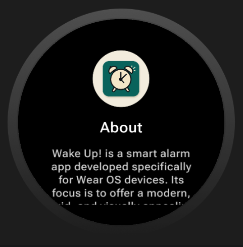
  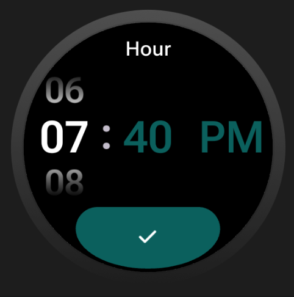
</div>

<div align="center">
  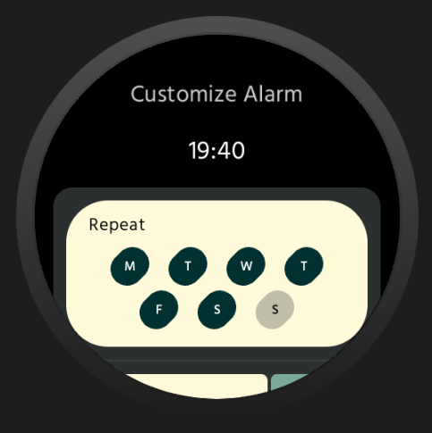
  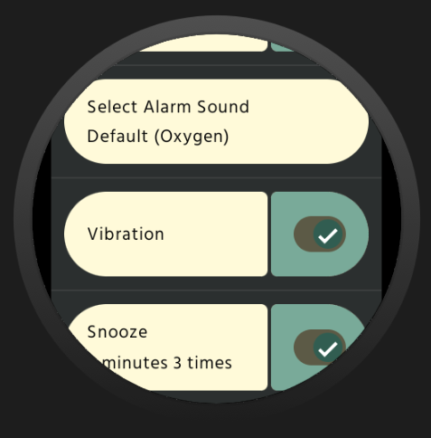
  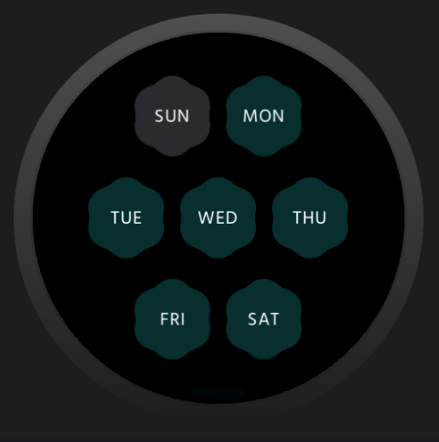
</div>

<div align="center">
  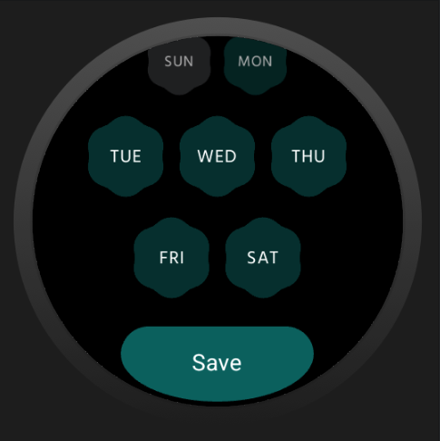
  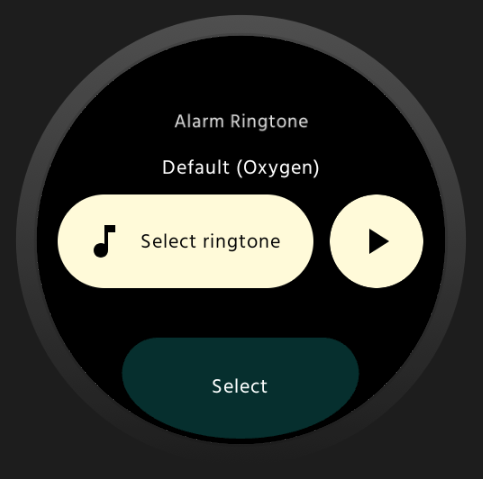
  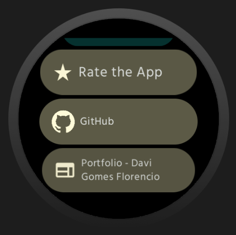
</div>

## Building the Project

1. Clone the repository:
   ```bash
   git clone https://github.com/davigomesflorencio/alarm_wear_app.git
   ```
2. Open in **Android Studio** (Ladybug or newer recommended).
3. Ensure you have the **Wear OS SDK** installed.
4. Run the project on a Wear OS emulator or physical device.

---

Developed by [Davi Gomes Florencio](https://github.com/davigomesflorencio)
